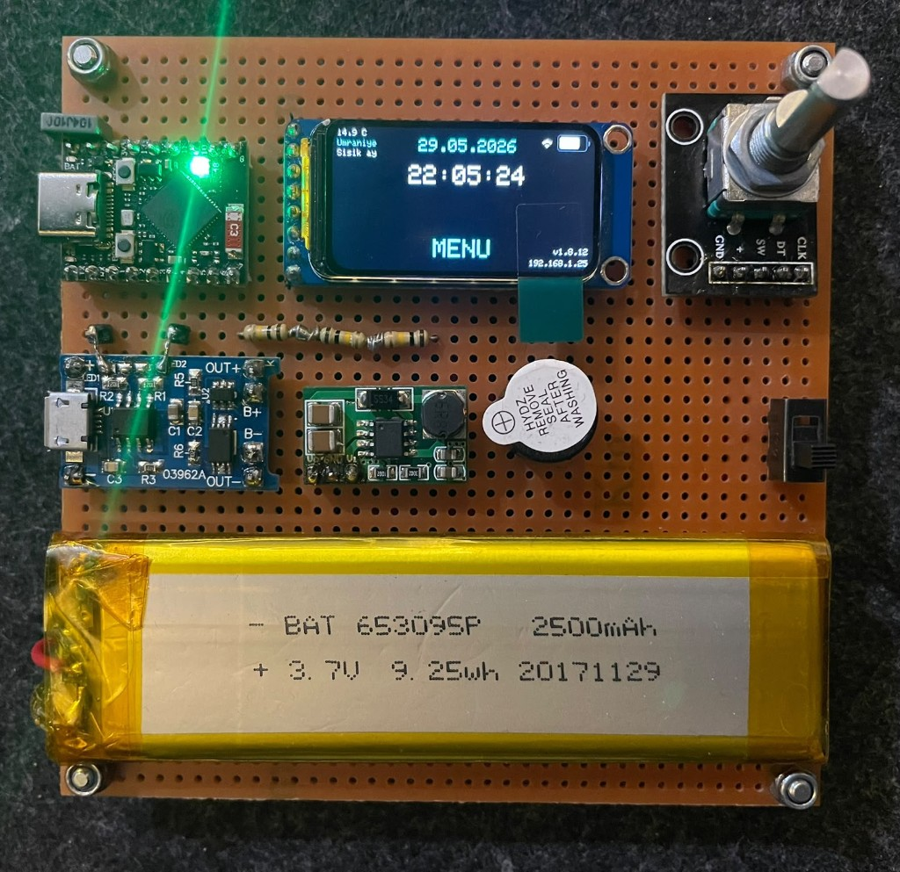
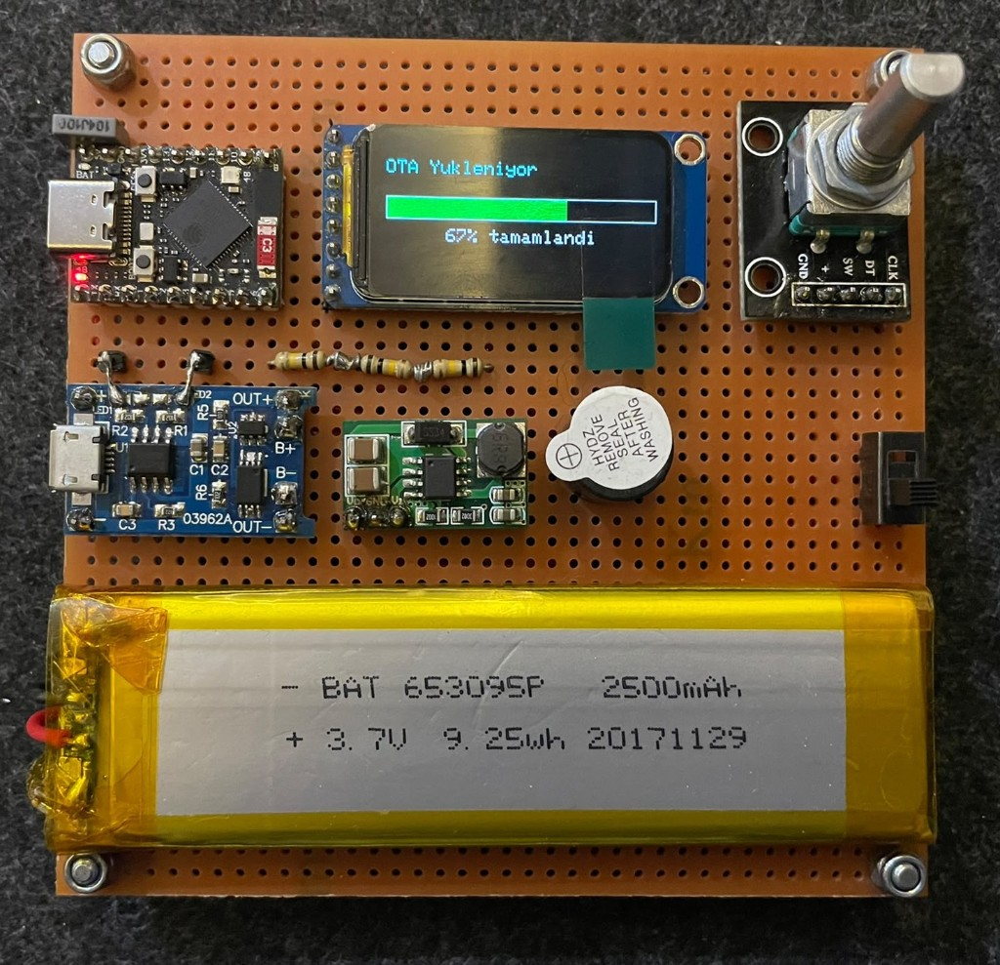
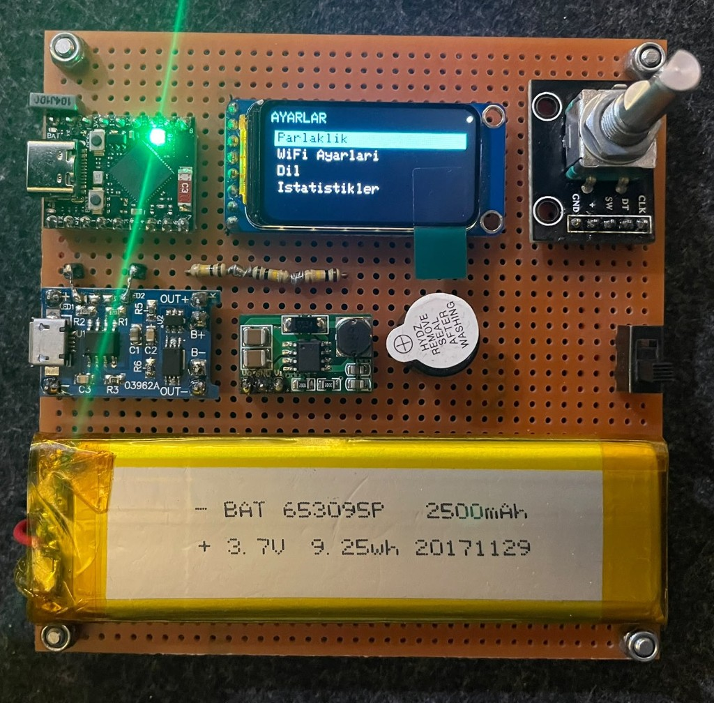
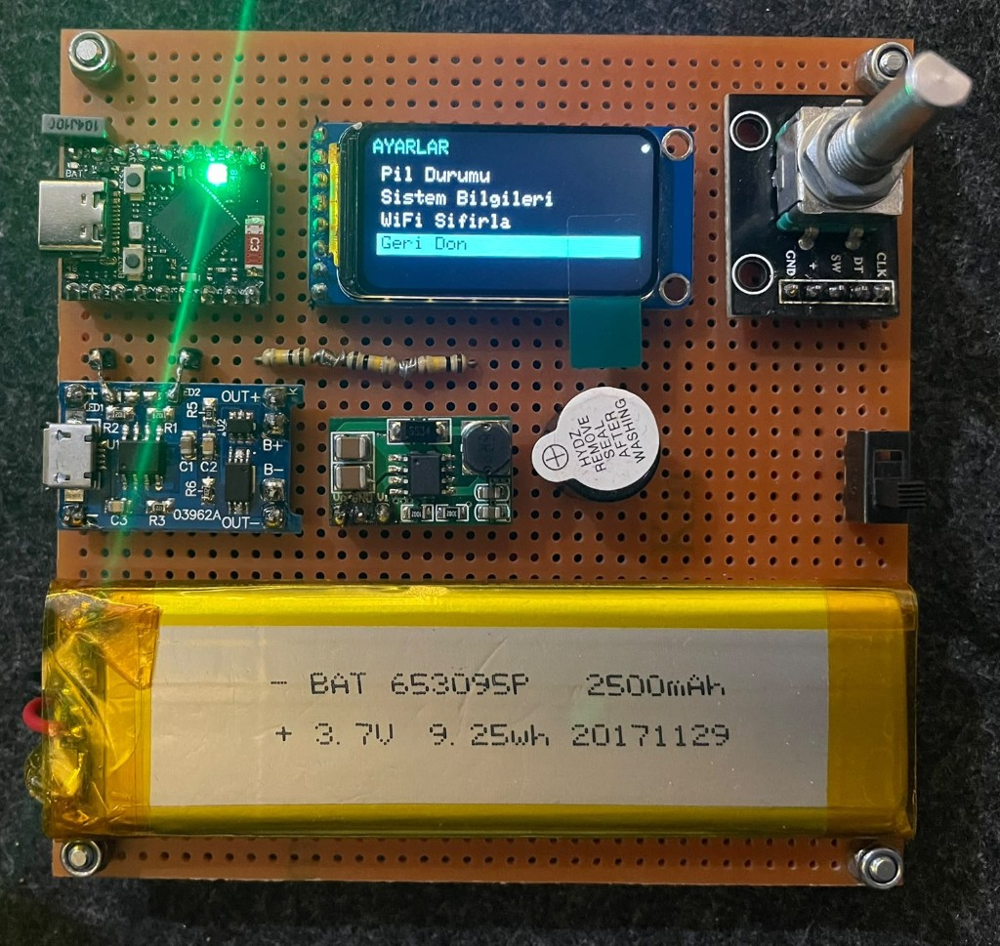

# ESP32 Smart Dashboard (ST7789)

<div align="center">


**ESP32-S3 Super Mini + ST7789 TFT — taşınabilir akıllı gösterge paneli**

WiFi, NTP saat, hava durumu, pil/şarj, encoder menü ve **WiFi OTA** ile kablosuz firmware güncelleme.

[Özellikler](#-özellikler) • [Görseller](#-proje-görselleri) • [Kurulum](#-kurulum) • [OTA](#-wifi-ota-güncelleme) • [Pinler](#-pin-bağlantıları-esp32-s3)

</div>

---

## 📋 İçindekiler

- [Özellikler](#-özellikler)
- [Proje Görselleri](#-proje-görselleri)
- [Donanım](#-donanım)
- [Kurulum](#-kurulum)
- [WiFi OTA Güncelleme](#-wifi-ota-güncelleme)
- [Kullanım](#-kullanım)
- [Pin Bağlantıları (ESP32-S3)](#-pin-bağlantıları-esp32-s3)
- [Yapılandırma](#-yapılandırma)
- [Proje Yapısı](#-proje-yapısı)
- [Sorun Giderme](#-sorun-giderme)
- [Sürüm Geçmişi](#-sürüm-geçmişi)

---

## ✨ Özellikler

### Ana ekran

- **Tarih ve saat** (NTP, GMT+3) — ortada büyük saat
- **Hava** (open-meteo, sabit konum Ümraniye): sıcaklık, bölge adı, durum (Güneşli, Yağmurlu…)
- **Gece modu:** güneş battıktan sonra ay fazı (Dolunay, İlk yarım, Hilal…)
- **Pil:** LiPo voltajı, yüzde, şarj ikonları (TP4056 CHRG/STDBY)
- **WiFi:** sinyal ikonu, IP adresi (sağ alt)
- **MENU** butonu (encoder ile ayarlar)

### Menüler (rotary encoder)

| Menü | İçerik |
|------|--------|
| Parlaklık | PWM backlight 0–100% |
| WiFi Ayarları | SSID, IP, RSSI |
| Dil | Türkçe / English |
| İstatistikler | Sıcaklık/nem istatistikleri, çip sıcaklığı, uptime |
| Pil Durumu | Canlı voltaj, şarj pinleri, ikon adı |
| Sistem Bilgileri | Firmware sürümü, WiFi, batarya |
| WiFi Sıfırla | Onaylı sıfırlama → captive portal |

### Diğer

- **WiFi OTA** — ekranda ilerleme çubuğu ve yüzde
- **WiFiManager** — ilk kurulum AP: `ESP32-Dashboard-Setup` / `1234`
- **Onboard RGB LED** (GPIO48) — WiFi / şarj / OTA / hata durumu
- **Ekran koruyucu** ve **Deep Sleep** (güç tasarrufu)
- **ESP32-C3** profili hâlâ `platformio.ini` içinde (yedek kart)

---

## 🖼️ Proje Görselleri

### Donanım

Perfboard üzerinde ESP32-S3, ST7789 OLED, encoder, TP4056 şarj, LiPo pil ve buzzer.


### Ana ekran

Sıcaklık, bölge (Ümraniye), hava/ay satırı, saat, pil, WiFi, MENU, IP ve firmware sürümü.



### WiFi OTA güncelleme

Firmware kablosuz yüklenirken ekranda yeşil ilerleme çubuğu ve tamamlanma yüzdesi.



### Ayarlar menüsü

Encoder ile kaydırılan çok sayfalı ayarlar listesi.





---

## 🔧 Donanım

| Bileşen | Açıklama |
|---------|----------|
| **ESP32-S3 Super Mini** | Ana kart (4 MB flash + 2 MB PSRAM tipik) |
| **ST7789** | 320×172 TFT, SPI |
| **Rotary encoder** | Menü ve parlaklık |
| **TP4056 + LiPo** | 3.7 V şarj ve besleme |
| **Buzzer** | GPIO11 (opsiyonel geri bildirim) |

> DHT11 kodda kapalı (`USE_DHT11 0`); hava verisi internetten alınır.

---

## 📦 Kurulum

### Gereksinimler

- [PlatformIO](https://platformio.org/) (VS Code eklentisi önerilir)
- USB veya WiFi OTA ile yükleme

### Projeyi alın

```bash
git clone https://github.com/recepuysal/esp32-c3-dashboard.git
cd esp32-c3-dashboard
```

### Derleme ve USB yükleme

```bash
# Varsayılan: esp32s3_super_mini (COM portunu platformio.ini'de ayarlayın)
pio run -t upload

pio device monitor
```

`platformio.ini` → `[env:esp32s3_super_mini]` → `upload_port = COM8` (kendi portunuz).

---

## 📡 WiFi OTA güncelleme

1. Cihazı WiFi'ye bağlayın — **ana ekranda IP** görünür (ör. `192.168.1.25`).
2. `platformio.ini` içinde OTA IP'sini güncelleyin:

```ini
[env:esp32s3_super_mini_ota]
upload_protocol = espota
upload_port = 192.168.1.25
upload_flags =
    --auth=1234
    --port=3232
```

3. PlatformIO alt çubardan ortam: **`esp32s3_super_mini_ota`**
4. Yükleyin:

```bash
pio run -e esp32s3_super_mini_ota -t upload
```

| Parametre | Değer |
|-----------|--------|
| OTA şifre | `1234` |
| Hostname | `sp_dashboard.local` |
| OTA port | `3232` |

Yükleme sırasında ekranda **「OTA Yukleniyor」** ve ilerleme yüzdesi görünür; RGB LED mavi yanıp söner.

---

## 🚀 Kullanım

### İlk WiFi kurulumu

1. Cihazı açın — kayıtlı WiFi yoksa AP modu: **`ESP32-Dashboard-Setup`** / şifre **`1234`**
2. Telefondan ağa bağlanın, tarayıcıda **`http://192.168.4.1`**
3. Ev WiFi SSID ve şifresini girin → cihaz yeniden başlar

### Encoder

- **Döndür:** menüde gezin / parlaklık ayarla  
- **Bas:** menüyü aç, seç, onayla, ana sayfaya dön (**Geri Don**)

### Ana ekran düzeni (sol üst)

```
14.9 C          ← sıcaklık
Umraniye        ← bölge (cyan)
Sisik ay        ← gündüz: hava | gece: ay fazı (beyaz)
```

---

## 🔌 Pin Bağlantıları (ESP32-S3)

| Fonksiyon | GPIO |
|-----------|------|
| TFT CS / DC / RST / SCK / MOSI / BL | 10 / 7 / 5 / 4 / 6 / 2 |
| Pil ADC (voltaj bölücü) | 1 |
| Encoder CLK / DT / SW | 8 / 9 / 3 |
| TP4056 CHRG / STDBY | 13 / 12 (active LOW) |
| Buzzer | 11 |
| Onboard WS2812 RGB | 48 |

**Pil bölücü:** LiPo+ — 100kΩ — GPIO1 — 200kΩ — GND  

**ESP32-C3** pinleri için `platformio.ini` içindeki `[env:esp32c3_super_mini]` bölümüne ve eski commit dokümantasyonuna bakın.

---

## ⚙️ Yapılandırma

| Ayar | Dosya / konum |
|------|----------------|
| Konum (hava) | `WEATHER_REGION_NAME`, `WEATHER_LAT`, `WEATHER_LON` — `src/main.cpp` |
| OTA şifre | `otaPass` — `src/main.cpp` |
| NTP | `gmtOffset_sec = 3*3600` (İstanbul) |
| Pil kalibrasyonu | `BAT_CALIB_VBAT`, `BAT_CALIB_ESP_ADC_V` |
| USB COM port | `platformio.ini` → `upload_port` |

---

## 📁 Proje Yapısı

```
ST7789/
├── src/
│   ├── main.cpp       # Firmware (v1.8.x)
│   └── logo.h         # İkonlar (pil, WiFi, splash)
├── docs/images/       # README fotoğrafları
├── extra_scripts/
│   └── ota_reset.py   # USB upload sonrası reset
├── platformio.ini     # S3 (varsayılan) + C3 ortamları
└── README.md
```

---

## 🐛 Sorun Giderme

| Sorun | Öneri |
|-------|--------|
| OTA bağlanmıyor | Aynı WiFi, doğru IP, şifre `1234`, port `3232` |
| Hava gelmiyor | WiFi ve NTP; Serial’de `Hava API` logları |
| Menüden dönünce sol üst boş | v1.8.14+ kullanın |
| S3 boot döngüsü | `board=esp32-s3-devkitc-1`, 4 MB flash profili — 8 MB kart profili kullanmayın |
| RGB çok parlak | `ONBOARD_RGB_BRIGHT` — `main.cpp` |

---

## 📝 Sürüm Geçmişi

### v1.8.14 (güncel)

- Menüden dönüşte hava/ay panelinin silinmesi düzeltildi
- Sol üst 3 satır: sıcaklık → bölge → hava/ay
- open-meteo hava durumu + gece ay fazı
- ESP32-S3 Super Mini ana hedef; onboard RGB (GPIO48)
- MENU konumu ve alt bar (IP, sürüm) iyileştirmeleri

### v1.5.0

- Pil/şarj ikonları, TP4056, Pil Durumu menüsü
- WiFiManager captive portal

Daha eski sürümler için git geçmişine bakın.

---

## 📄 Lisans

MIT — ayrıntılar için `LICENSE`.

## 👤 Yazar

**Recep UYSAL** — [@recepuysal](https://github.com/recepuysal)

---

<div align="center">

**⭐ Projeyi beğendiyseniz GitHub'da yıldız verebilirsiniz! ⭐**

[GitHub Issues](https://github.com/recepuysal/esp32-c3-dashboard/issues)

</div>
